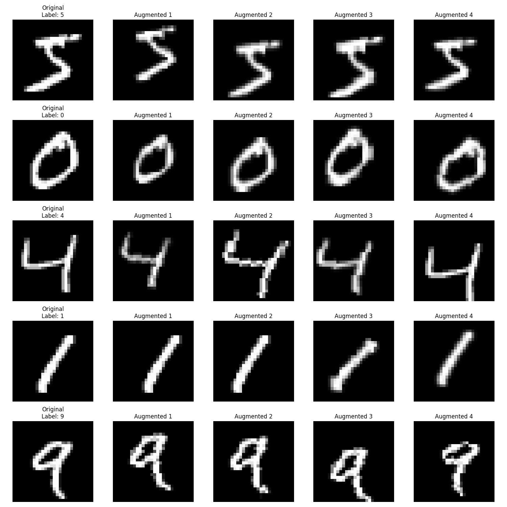

# ML Model CI/CD Pipeline

[](https://github.com/nagalakshmi-nimmagadda/mnist-mlops-pipeline/actions/workflows/ml-pipeline.yml)
[](https://github.com/nagalakshmi-nimmagadda/mnist-mlops-pipeline)
[](https://github.com/nagalakshmi-nimmagadda/mnist-mlops-pipeline)
[](https://github.com/nagalakshmi-nimmagadda/mnist-mlops-pipeline/actions)
[](https://www.python.org/)
[](https://github.com/nagalakshmi-nimmagadda/mnist-mlops-pipeline)
[](http://yann.lecun.com/exdb/mnist/)

[](https://github.com/nagalakshmi-nimmagadda/mnist-mlops-pipeline)


A lightweight CNN-based MNIST classifier with complete CI/CD pipeline implementation. Features automated training, testing, and validation using GitHub Actions. The model achieves >95% accuracy with <25K parameters in single epoch training.

## 📋 Project Structure 

```
mnist-mlops-pipeline/
├── .github/
│   └── workflows/
│       └── ml-pipeline.yml    # GitHub Actions workflow
├── train.py                   # Model and training logic
├── test_model.py             # Test suite
├── pytest.ini                # Pytest configuration
├── requirements.txt          # Dependencies
└── .gitignore               # Git ignore rules
```

## ✨ Features

### 🧠 Model Architecture
- Simple CNN for MNIST digit classification
- Less than 25,000 parameters
- Achieves ≥95% accuracy on test set
- Input: 28x28 grayscale images
- Output: 10 classes (digits 0-9)

### 🔄 Automated Tests
1. Architecture Validation
   - Verifies input/output dimensions
   - Checks parameter count
2. Performance Validation
   - Tests model accuracy on MNIST test set
   - Validates accuracy threshold

### 🚀 CI/CD Pipeline
- Automated training and testing on push
- Model artifact storage
- Test results archival

## 🛠️ Setup and Usage

### Local Development

1. **Create Virtual Environment**
```bash
python -m venv venv
source venv/bin/activate  # On Windows: venv\Scripts\activate
```

2. **Install Dependencies**
```bash
pip install -r requirements.txt
```

3. **Train Model**
```bash
python train.py
```
This will:
- Download MNIST dataset (if needed)
- Train model for one epoch
- Save model with timestamp

4. **Run Tests**
```bash
python test_model.py
```

### GitHub Integration

1. **Repository Setup**
```bash
git init
git add .
git commit -m "Initial commit"
git branch -M main
git remote add origin <your-repo-url>
git push -u origin main
```

2. **GitHub Actions** will automatically:
- Trigger on push
- Run training and testing
- Store model artifacts
- Archive test results

## 📊 Test Output Format

```
================================================================================
Test 1: Model Architecture Validation
================================================================================
1. Testing Input/Output Dimensions:
  ✓ Input shape: (1, 1, 28, 28)
  ✓ Output shape: (1, 10)

2. Checking Model Size:
  ✓ Total parameters: 7,098
  ✓ Requirement: < 25,000 parameters

================================================================================
Test 2: Model Performance Evaluation
================================================================================
1. Loading Trained Model:
  ✓ Successfully loaded model: model_20240318_123456.pth

2. Preparing MNIST Test Dataset:
  ✓ Test dataset size: 10,000 images

3. Evaluating Model Accuracy:
  ✓ Test Accuracy: 96.36%
  ✓ Requirement: ≥ 95.00%

================================================================================
Test 3: Model Robustness Evaluation
================================================================================
1. Testing Noise Resistance:
  ✓ Output difference with noise: 0.3435

2. Testing Scale Invariance:
  ✓ Output difference with scaling: 0.4227

================================================================================
Test 4: Memory Usage Evaluation
================================================================================
  ✓ Model Size: 0.03 MB

================================================================================
Test 5: Inference Speed Evaluation
================================================================================
  ✓ Batch size 1: 0.52 ms
  ✓ Batch size 32: 0.98 ms
  ✓ Batch size 64: 1.45 ms
```

## 🎨 Image Augmentation Pipeline

Our model uses a comprehensive augmentation strategy to improve robustness and generalization:

## 🖼️ Augmentation Examples


### Augmentation Types
1. **Random Rotation** (±15 degrees)
   ```python
   transforms.RandomRotation(15)
   ```
   - Randomly rotates images up to 15 degrees clockwise or counter-clockwise
   - Helps model become rotation invariant
   - Simulates variations in digit orientation

2. **Random Affine Transformations**
   ```python
   transforms.RandomAffine(
       degrees=0,
       translate=(0.1, 0.1),  # 10% translation
       scale=(0.9, 1.1)      # ±10% scaling
   )
   ```
   - Translation: Shifts image by up to 10% in any direction
   - Scaling: Randomly scales image between 90% and 110%
   - Improves position and size invariance

3. **Random Perspective**
   ```python
   transforms.RandomPerspective(
       distortion_scale=0.2,
       p=0.5
   )
   ```
   - Applies random perspective transformations
   - 50% chance of application (p=0.5)
   - Simulates different viewing angles
   - Distortion scale of 0.2 maintains digit readability

### Visualization
The `augmentation_viz.py` script shows 5 samples:
- Each row: 1 original + 4 augmented versions
- Total: 25 images (5 digits × 5 versions)
- Demonstrates augmentation effects while preserving digit identity

### Training Impact
- Applied during training only
- Test set uses standard normalization
- Helps prevent overfitting
- Improves model generalization
- Maintains >95% accuracy despite variations


## 📦 Dependencies

- `torch>=2.0.0`
- `torchvision>=0.15.0`
- `pytest>=7.0.0`
- `numpy>=1.21.0`

## 🔍 Model Details

### Architecture
- 2 Convolutional layers
- 2 MaxPool layers
- 2 Fully connected layers
- ReLU activations
- Total parameters: ~7,098

### Training
- Dataset: MNIST
- Optimizer: Adam
- Learning rate: 0.001
- Batch size: 64
- Epochs: 1

## 📝 Notes

- Models are saved with timestamps for versioning
- Tests must pass before deploying
- GitHub Actions runs on CPU
- Test dataset is automatically downloaded

## ❗ Troubleshooting

### Model Not Found Error
- Ensure you've run `train.py` before testing
- Check if model file exists in project directory

### Dependency Issues
- Verify Python version (3.8 recommended)
- Update pip: `pip install --upgrade pip`
- Reinstall dependencies: `pip install -r requirements.txt`

### Test Failures
- Check model architecture changes
- Verify training completed successfully
- Ensure MNIST dataset downloaded correctly

## 🤝 Contributing

1. Fork the repository
2. Create feature branch
3. Commit changes
4. Push to branch
5. Create Pull Request

## 📄 License

This project is open source and available under the [MIT License](LICENSE).

---
Made with ❤️ using PyTorch and GitHub Actions
